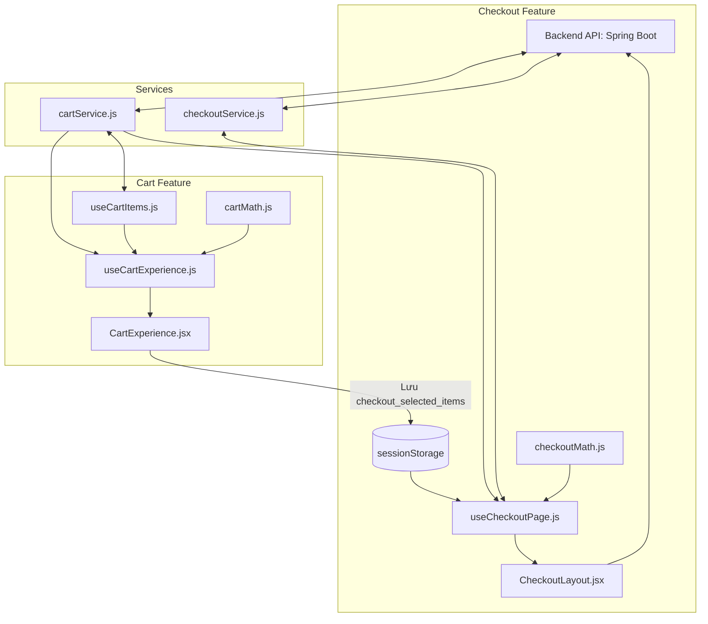

# Tài liệu Luồng Logic: Giỏ hàng (Cart) & Thanh toán (Checkout)

Tài liệu này mô tả chi tiết kiến trúc, luồng dữ liệu (Data Flow) và logic xử lý của quy trình Giỏ hàng và Thanh toán. Hệ thống tuân thủ thiết kế **tách biệt hoàn toàn 100% (Fully Decoupled)**: độc lập về Dữ liệu (Mock/API), Logic (Hooks) và Giao diện (CSS).

---

## 1. Sơ đồ Kiến trúc Tổng quan (Architecture Diagram)

---

## 2. Phần Giỏ hàng (Cart)

Toàn bộ logic giỏ hàng nằm trong thư mục `features/cart`. 

### 2.1. Lớp Dịch vụ - `services/cartService.js`
Nơi chứa các hàm tương tác trực tiếp với API Backend. Nếu Backend lỗi, hàm sẽ trả về dữ liệu ảo (`cartMock.js`).
- `getCartSnapshot()`: Lấy dữ liệu giỏ hàng mới nhất (chỉ chứa mảng `items`).
- `addItemAPI(itemPayload)`: API thêm sản phẩm mới vào giỏ hàng.
- `updateQuantityAPI(itemId, quantity)`: API cập nhật số lượng của một sản phẩm.
- `removeItemAPI(itemId)`: API xóa một sản phẩm khỏi giỏ hàng.
- `clearUnavailableItemsAPI(itemIds)`: API xóa nhiều sản phẩm (thường dùng để dọn các sản phẩm hết hàng).

### 2.2. Lớp Toán học - `utils/cartMath.js`
- `getItemSubtotal(item)`: Tính toán tổng tiền của duy nhất một sản phẩm (Giá x Số lượng).
- `getItemsSubtotal(items)`: Hàm tính toán tổng tiền của danh sách sản phẩm được truyền vào.

### 2.3. Lớp Quản lý Trạng thái Sản phẩm - `hooks/useCartItems.js`
Chuyên quản lý mảng sản phẩm và các thao tác thay đổi số lượng, xóa sản phẩm.
- `isPurchasable(item)`: Hàm kiểm tra xem sản phẩm có hợp lệ để mua không (`isActive` = true và `stockQuantity` > 0).
- `addToCart(newItem)`: Xử lý logic gộp số lượng nếu sản phẩm đã tồn tại trong giỏ, hoặc thêm mới nếu chưa có. Gọi `addItemAPI`. Cảnh báo nếu vượt tồn kho.
- `changeItemQuantity(itemId, nextQuantity)`: Chặn số lượng không vượt quá `stockQuantity`, gọi `updateQuantityAPI` và cập nhật giao diện (Optimistic UI).
- `removeItem(itemId)`: Gọi `removeItemAPI`, xóa ID sản phẩm khỏi mảng `items` và `selectedItemIds`.
- `clearUnavailableItems()`: Tìm tất cả sản phẩm không `isPurchasable` và gọi `clearUnavailableItemsAPI` để xóa hàng loạt.
- `toggleItem(itemId)`: Đảo trạng thái chọn/bỏ chọn của một sản phẩm (thêm/bớt ID vào `selectedItemIds`).
- `toggleSelectAll()`: Chọn tất cả sản phẩm hợp lệ, hoặc bỏ chọn tất cả.

### 2.4. Lớp Trải nghiệm Người dùng - `hooks/useCartExperience.js`
Đóng vai trò "nhạc trưởng", kết hợp `useCartItems` và các hiệu ứng tổng thể của trang Giỏ hàng.
- `refreshCartSnapshot()`: Gọi `getCartSnapshot()` để tải lại số liệu tồn kho mới nhất.
- `proceedToCheckout()`: Hàm kích hoạt khi bấm nút "Thanh toán". 
  1. Gọi `refreshCartSnapshot()` để validate.
  2. Tự động ép `quantity` xuống bằng `stockQuantity` (Capping) nếu khách chọn lố.
  3. Cảnh báo lỗi nếu có biến động kho hàng.
  4. Nếu hợp lệ, lưu `selectedItemIds` vào `sessionStorage` dưới dạng chuỗi JSON `checkout_selected_items`.
  5. Gọi lệnh `navigate('/checkout')`.

### 2.5. Lớp Giao diện (UI Components) - `components/CartExperience/`
- `CartExperience.jsx`: Layout bao ngoài của trang Giỏ hàng. Điều phối State từ hook xuống cho các component con.
- `CartItemList.jsx`: Danh sách sản phẩm, chứa logic chọn tất cả và xóa sản phẩm hết hàng.
- `CartItemCard.jsx`: Hiển thị chi tiết từng sản phẩm, bao gồm ô nhập số lượng, thông tin tồn kho, nút xóa.

---

## 3. Phần Thanh toán (Checkout)

Quy trình độc lập, nằm trong thư mục `features/checkout`, sử dụng giao diện riêng (`.checkoutx-*`).

### 3.1. Lớp Dịch vụ - `services/checkoutService.js`
- `getAddressesAPI()`: Tải danh sách sổ địa chỉ của người dùng.
- `getShippingMethodsAPI()`: Tải danh sách các phương thức vận chuyển có sẵn.
- `addAddressAPI(addressData)`: Thêm một địa chỉ mới vào sổ địa chỉ.
- `applyVoucherAPI(code)`: Kiểm tra mã giảm giá. Trả về thông tin voucher nếu hợp lệ.

### 3.2. Lớp Toán học - `utils/checkoutMath.js`
- `getDiscountAmount({ voucher, itemsSubtotal, shippingFee })`: Tính toán số tiền được giảm dựa trên loại voucher (`fixed`, `percent`, `shipping`).
- `getCartTotals({ itemsSubtotal, shippingFee, discountAmount })`: Tính toán `finalTotal` (Tổng tiền cuối cùng = Tiền hàng + Phí ship - Khuyến mãi).

### 3.3. Lớp Quản lý Trạng thái Thanh toán - `hooks/useCheckoutPage.js`
Quản lý toàn bộ tiến trình trang Thanh toán.
- `initCheckout()`: Chạy tự động khi vào trang.
  1. Đọc mảng ID từ `sessionStorage`. Nếu rỗng, văng lỗi.
  2. Dùng `Promise.all` gọi song song: `getCartSnapshot()`, `getAddressesAPI()`, `getShippingMethodsAPI()`.
  3. Lọc mảng `items` chỉ giữ lại các sản phẩm được tick chọn ở giỏ hàng.
  4. Khởi tạo mặc định `selectedAddressId` và `selectedShippingId`.
- `addAddress(addrPayload)`: Gọi `addAddressAPI` để lưu địa chỉ, sau đó tự động chọn địa chỉ vừa thêm.
- `applyVoucher()`: Lấy mã từ `voucherInput`, gọi `applyVoucherAPI(code)` và cập nhật thông báo thành công/thất bại (`voucherNotice`).

### 3.4. Xử lý Đặt hàng - `handlePlaceOrder` (Nằm trong `CheckoutLayout.jsx`)
- Khối logic `handlePlaceOrder` thực hiện:
  1. Dùng biến `canCheckout` (do hook cung cấp) để chặn gửi đơn nếu thiếu địa chỉ hoặc vận chuyển.
  2. Gói dữ liệu (Payload) bao gồm: `items`, `shippingAddressId`, `paymentMethod`, `note`, `voucherCode`.
  3. Gửi lệnh `api.post('/orders', requestBody)`.
  4. Xử lý Mock (Cho lúc Backend sập): Chủ động bắt lỗi ở khối `catch` và sinh mã đơn ảo (`ORD-MOCK-...`).
  5. Giả lập thanh toán: Ngưng hệ thống 2 giây nếu chọn VNPay/MoMo.
  6. Hoàn tất: Xóa `checkout_selected_items` trong `sessionStorage`, bật Modal thông báo thành công.

### 3.5. Lớp Giao diện (UI Components) - `components/`
- `CheckoutLayout.jsx`: File cha đóng vai trò Layout toàn trang, chứa hàm đặt hàng và Modal báo công/lỗi.
- `AddressSelection.jsx`: Hiển thị danh sách thẻ địa chỉ và đánh dấu địa chỉ đang chọn.
- `AddressFormModal.jsx`: Cửa sổ Popup (Modal) dùng để điền tên, điện thoại, tỉnh/thành phố thêm địa chỉ mới.
- `ShippingSelection.jsx`: Hiển thị các gói vận chuyển.
- `PaymentMethodSelector.jsx`: Danh sách các lựa chọn thanh toán bằng thẻ, ví điện tử hay COD.
- `VoucherSelection.jsx`: Form nhập mã giảm giá và báo lỗi trực tiếp.
- `CheckoutSummary.jsx`: Bảng tóm tắt thanh toán bên phải (chứa Nút Đặt hàng, Phí ship, Giảm giá).
