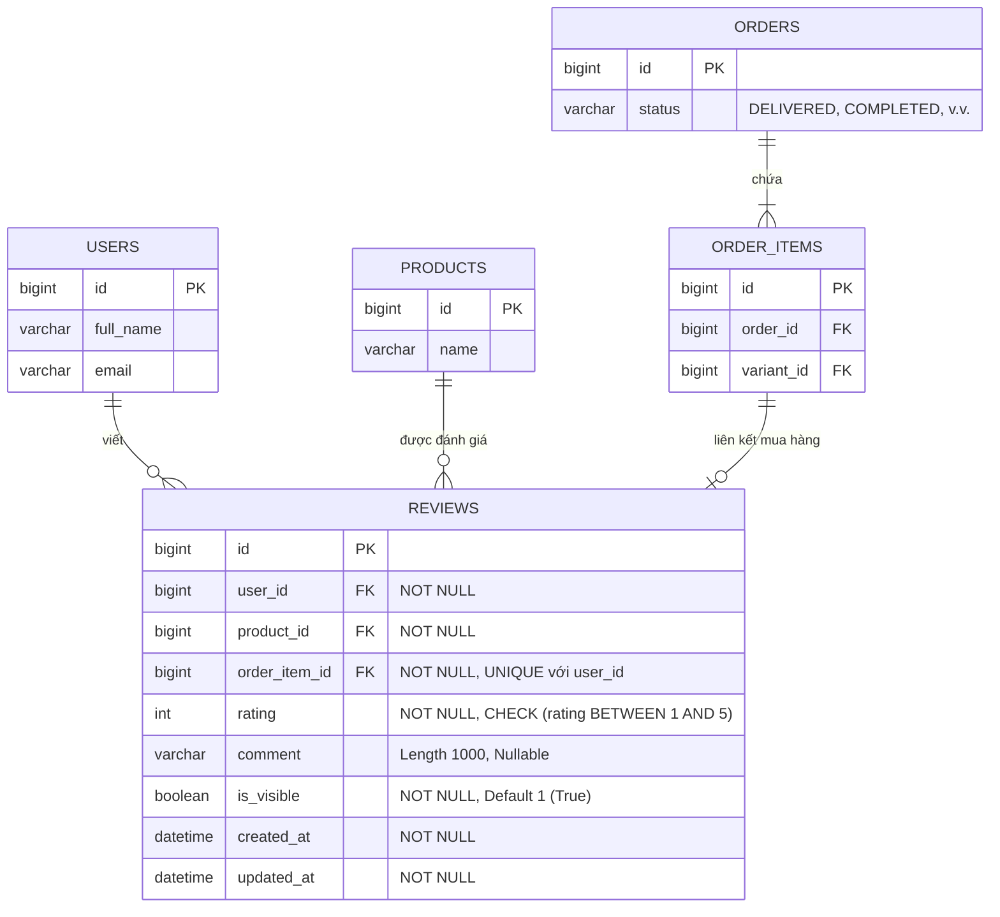
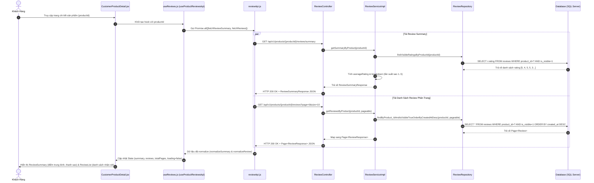
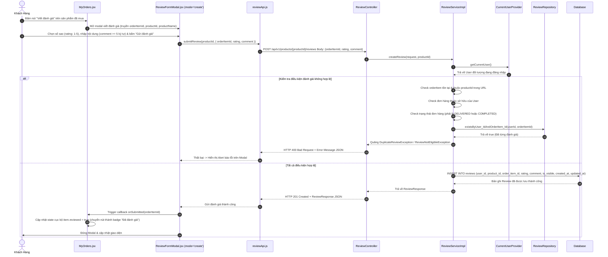
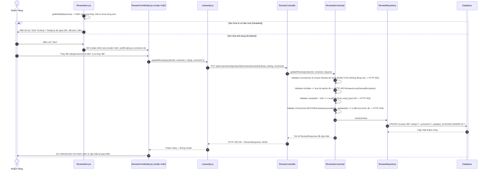
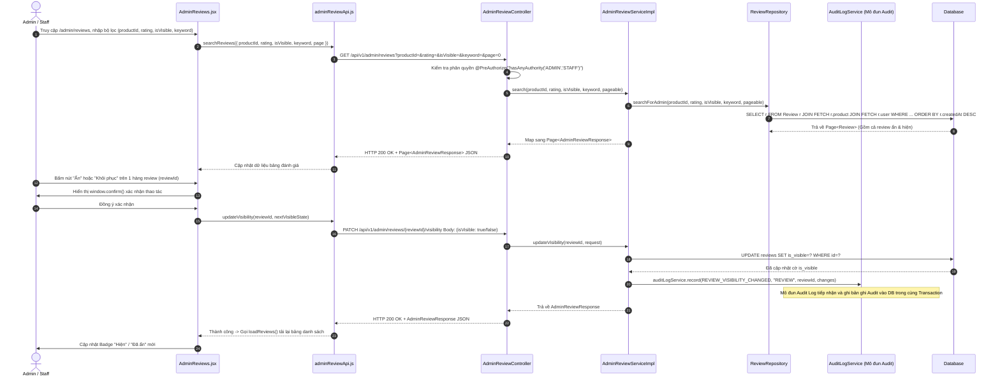

# Tài Liệu Dữ Liệu & Luồng Hoạt Động (Data-Flow) — Mô Đun Đánh Giá Sản Phẩm (Review)

---

## 1. Tổng Quan Về Mô Đun Review & Phạm Vi Trách Nhiệm

Mô đun **Review (Đánh giá sản phẩm)** là một thành phần quan trọng trong hệ thống thương mại điện tử `sba301-clothing-shop`, cho phép người mua phản hồi về chất lượng sản phẩm sau khi nhận hàng, giúp người dùng khác tham khảo và hỗ trợ Admin/Staff quản lý chất lượng nội dung công khai trên nền tảng.

### 1.1. Phạm Vi Trách Nhiệm Được Xác Định
- **Phía Khách Hàng (Customer)**:
  1. Xem danh sách đánh giá công khai (chỉ xem các review đang hiện `isVisible = true`), xem tổng quan điểm đánh giá (Rating Summary: trung bình số sao và biểu đồ phân bố 1-5 sao).
  2. Viết đánh giá mới cho sản phẩm đã mua (yêu cầu đơn hàng ở trạng thái `DELIVERED` hoặc `COMPLETED`, chưa từng đánh giá mặt hàng đó).
  3. Chỉnh sửa đánh giá của chính mình (trong thời hạn **24 giờ** kể từ khi tạo và **chỉ được sửa tối đa 1 lần**).
- **Phía Quản Trị (Admin / Staff)**:
  1. Tra cứu, lọc toàn bộ đánh giá hệ thống (bao gồm cả review bị ẩn) theo ID sản phẩm, số sao, trạng thái ẩn/hiện và từ khoá.
  2. Thao tác **Ẩn (Hide)** hoặc **Khôi phục (Restore)** một đánh giá bất kỳ.
- **Tích Hợp Ngoại Vi (External Integration)**:
  - Khi Admin đổi trạng thái ẩn/hiện của review, hệ thống gọi `AuditLogService` để ghi nhật ký hoạt động. *(Lưu ý: Mô đun Audit Log thuộc phạm vi quản lý của thành viên khác trong nhóm, mô đun Review chỉ đóng vai trò gửi yêu cầu ghi log).*

---

### 1.2. Danh Sách Các File Mã Nguồn Thuộc Mô Đun Review

| Tầng | Loại File | Đường Dẫn File | Vai Trò & Chức Năng |
| :--- | :--- | :--- | :--- |
| **Backend** | Entity | [`Review.java`](file:///d:/MiniProject/sba301-clothing-shop/backend/src/main/java/com/sba301/ecommerce/features/entities/Review.java) | Khai báo bảng `reviews`, các mối quan hệ `@ManyToOne` và các constraint. |
| **Backend** | Controller | [`ReviewController.java`](file:///d:/MiniProject/sba301-clothing-shop/backend/src/main/java/com/sba301/ecommerce/features/review/controller/ReviewController.java) | Endpoints công khai & khách hàng (`GET`, `POST`, `PUT` dưới path `/products/{productId}/reviews`). |
| **Backend** | Controller | [`AdminReviewController.java`](file:///d:/MiniProject/sba301-clothing-shop/backend/src/main/java/com/sba301/ecommerce/features/review/controller/AdminReviewController.java) | Endpoints admin (`GET`, `PATCH` dưới path `/admin/reviews`). Bảo mật `@PreAuthorize("hasAnyAuthority('ADMIN','STAFF')")`. |
| **Backend** | Service | [`ReviewService.java`](file:///d:/MiniProject/sba301-clothing-shop/backend/src/main/java/com/sba301/ecommerce/features/review/service/ReviewService.java) & [`ReviewServiceImpl.java`](file:///d:/MiniProject/sba301-clothing-shop/backend/src/main/java/com/sba301/ecommerce/features/review/service/ReviewServiceImpl.java) | Logic nghiệp vụ: kiểm tra tư cách đánh giá, tính summary rating, validate 24h & 1-lần sửa. |
| **Backend** | Service | [`AdminReviewService.java`](file:///d:/MiniProject/sba301-clothing-shop/backend/src/main/java/com/sba301/ecommerce/features/review/service/AdminReviewService.java) & [`AdminReviewServiceImpl.java`](file:///d:/MiniProject/sba301-clothing-shop/backend/src/main/java/com/sba301/ecommerce/features/review/service/AdminReviewServiceImpl.java) | Logic admin: tìm kiếm đa tiêu chí, toggle `isVisible` & gọi `AuditLogService`. |
| **Backend** | Repository | [`ReviewRepository.java`](file:///d:/MiniProject/sba301-clothing-shop/backend/src/main/java/com/sba301/ecommerce/features/review/repository/ReviewRepository.java) | JPQL queries: lọc review công khai, thống kê sao, check trùng review, query admin có `JOIN FETCH`. |
| **Backend** | Mapper / DTO | [`ReviewMapper.java`](file:///d:/MiniProject/sba301-clothing-shop/backend/src/main/java/com/sba301/ecommerce/features/review/mapper/ReviewMapper.java) & Các DTOs | Chuyển đổi dữ liệu giữa Entity và Request/Response DTOs. |
| **Backend** | Exceptions | `DuplicateReviewException.java`, `ReviewNotEligibleException.java`, `ReviewAccessDeniedException.java` | Ngoại lệ nghiệp vụ review (được xử lý ở `GlobalExceptionHandler.java`). |
| **Frontend** | Service API | [`reviewApi.js`](file:///d:/MiniProject/sba301-clothing-shop/frontend/src/features/reviews/services/reviewApi.js) | Gọi Axios API phía khách hàng, chuẩn hoá dữ liệu trả về (`normalizeReview`, `normalizeSummary`). |
| **Frontend** | Service API | [`adminReviewApi.js`](file:///d:/MiniProject/sba301-clothing-shop/frontend/src/features/reviews/services/adminReviewApi.js) | Gọi Axios API phía admin (`searchReviews`, `updateVisibility`). |
| **Frontend** | Hook | [`useReviews.js`](file:///d:/MiniProject/sba301-clothing-shop/frontend/src/features/reviews/hooks/useReviews.js) | Custom Hook `useProductReviewsApi` quản lý state review, summary và phân trang. |
| **Frontend** | Components | [`ReviewSummary.jsx`](file:///d:/MiniProject/sba301-clothing-shop/frontend/src/features/reviews/components/ReviewSummary.jsx), [`ReviewList.jsx`](file:///d:/MiniProject/sba301-clothing-shop/frontend/src/features/reviews/components/ReviewList.jsx), [`ReviewItem.jsx`](file:///d:/MiniProject/sba301-clothing-shop/frontend/src/features/reviews/components/ReviewItem.jsx), [`ReviewFormModal.jsx`](file:///d:/MiniProject/sba301-clothing-shop/frontend/src/features/reviews/components/ReviewFormModal.jsx) | Giao diện hiển thị danh sách đánh giá, bộ lọc sao client-side, modal viết/sửa đánh giá. |
| **Frontend** | Pages | [`CustomerProductDetail.jsx`](file:///d:/MiniProject/sba301-clothing-shop/frontend/src/features/products/pages/CustomerProductDetail.jsx), [`MyOrders.jsx`](file:///d:/MiniProject/sba301-clothing-shop/frontend/src/features/orders/pages/MyOrders.jsx), [`AdminReviews.jsx`](file:///d:/MiniProject/sba301-clothing-shop/frontend/src/features/reviews/pages/AdminReviews.jsx) | Màn hình chi tiết sản phẩm, lịch sử đơn hàng và màn hình quản lý đánh giá của admin. |

---

## 2. Mô Hình Dữ Liệu & Ràng Buộc Database (Data Model & Database Constraints)

### 2.1. Sơ Đồ Thực Thể Entity Relationship (ERD)

### 2.2. Chi Tiết Thuộc Tính Bảng `reviews`
- **Constraint `uk_reviews_user_order_item`**: Đảm bảo 1 Khách hàng chỉ có thể tạo duy nhất 1 đánh giá cho 1 `order_item` đã mua.
- **Index `ix_reviews_product`**: Tối ưu tốc độ truy vấn danh sách review theo `product_id`.
- **Cờ `is_visible`**: Quản lý việc ẩn/hiện đánh giá do Admin/Staff điều khiển. Đánh giá bị ẩn không bị xoá khỏi cơ sở dữ liệu để phục vụ kiểm toán và không làm mất toàn vẹn dữ liệu.
- **Cơ chế phát hiện "Đã sửa 1 lần"**:
  Do Hibernate `@UpdateTimestamp` tự động điền giá trị cho `updated_at` ngay cả lúc `INSERT` (bằng thời gian với `created_at`), hệ thống áp dụng ngưỡng dung sai `EDIT_DETECTION_TOLERANCE_SECONDS = 5`. Đánh giá được xem là "đã sửa" nếu:
  $$\text{ChronoUnit.SECONDS.between}(\text{createdAt}, \text{updatedAt}) > 5$$

---

## 3. Chi Tiết Luồng Hoạt Động (Data-Flow) & Sơ Đồ Sequence

### 3.1. Luồng 1: Khách Hàng Xem Danh Sách & Summary Đánh Giá Công Khai

Khi khách hàng truy cập vào trang Chi tiết sản phẩm (`CustomerProductDetail.jsx`), hệ thống sẽ tải song song danh sách đánh giá và thông tin tổng quan số sao của sản phẩm đó.

---

### 3.2. Luồng 2: Khách Hàng Viết Đánh Giá Mới Từ Đơn Hàng Đã Hoàn Thành

Khách hàng chọn sản phẩm trong danh sách đơn hàng đã hoàn tất (`MyOrders.jsx`) để viết đánh giá. `userId` được trích xuất an toàn từ `SecurityContext` ở Backend (chống giả mạo identity).

---

### 3.3. Luồng 3: Khách Hàng Chỉnh Sửa Đánh Giá Đã Tạo

Khách hàng chỉ có thể chỉnh sửa đánh giá của chính mình nếu:
1. Đánh giá chưa bị Admin ẩn (`isVisible = true`).
2. Thời gian kể từ lúc tạo đến hiện tại **$\le$ 24 giờ**.
3. Đánh giá **chưa từng được sửa lần nào trước đó** ($\text{updatedAt} - \text{createdAt} \le 5\text{s}$).

---

### 3.4. Luồng 4: Admin/Staff Quản Lý, Lọc & Thao Tác Ẩn/Khôi Phục Đánh Giá

Admin/Staff truy cập trang quản lý đánh giá (`AdminReviews.jsx`) để kiểm duyệt nội dung. Khi đổi trạng thái ẩn/hiện, dịch vụ review gọi `AuditLogService` để thực hiện ghi nhật ký kiểm toán.

---

## 4. Quản Lý Lỗi & Xử Lý Ngoại Lệ (Error Handling Matrix)

| Ngoại Lệ (Exception) | HTTP Status Code | Nguyên Nhân Tác Động | Thông Điệp Báo Về FE | Hành Động Hiển Thị Phía FE |
| :--- | :--- | :--- | :--- | :--- |
| `InvalidCredentialsException` | **401 Unauthorized** | Người dùng chưa đăng nhập khi gửi request tạo/sửa review. | *"Bạn cần đăng nhập để đánh giá sản phẩm."* | Chuyển hướng người dùng sang trang Đăng nhập. |
| `ReviewNotEligibleException` | **400 Bad Request** | Đơn hàng chưa giao (`DELIVERED`/`COMPLETED`), hoặc `orderItem` không thuộc về user/product. | *"Đơn hàng này không thuộc về bạn..."* hoặc *"Đơn hàng chưa được giao..."* | Hiển thị thông báo Alert màu đỏ trên Modal tạo review. |
| `DuplicateReviewException` | **400 / 409 Conflict** | Người dùng cố gắng gửi đánh giá thứ 2 cho cùng 1 `orderItem`. | *"Bạn đã đánh giá sản phẩm này rồi, không thể đánh giá lại."* | Hiển thị Alert cảnh báo, giữ nguyên cờ `reviewed=true`. |
| `ReviewAccessDeniedException` | **403 Forbidden** | Review đã bị admin ẩn, đã quá 24 giờ kể từ khi tạo, hoặc đã từng được sửa 1 lần. | *"Đã quá 24 giờ..."* hoặc *"Đánh giá này đã được chỉnh sửa trước đó..."* | Khoá nút "Sửa", hiển thị Tooltip giải thích trên UI. |
| `ResourceNotFoundException` | **404 Not Found** | Không tìm thấy `reviewId`, `productId` không khớp, hoặc user không phải chủ sở hữu review. | *"Không tìm thấy review."* | Giấu sự tồn tại của review thuộc về người khác (bảo mật dữ liệu). |

---

## 5. Chi Tiết Tối Ưu Tầng Dữ Liệu & Bảo Mật (Performance & Security Deep Dive)

### 5.1. Xử Lý Triệt Để Vấn Đề N+1 Query
1. **Nạp Danh Sách Đơn Hàng Phía Khách (`OrderServiceImpl.listMyOrders`)**:
   Khi lấy danh sách đơn hàng, thay vì truy vấn `existsByUser_IdAndOrderItem_Id` lặp lại $N$ lần cho từng sản phẩm trong đơn, hệ thống gọi `reviewRepository.findReviewedOrderItemIdsByUserId(userId)` 1 lần duy nhất để lấy tập hợp `Set<Long> reviewedOrderItemIds`, giúp thời gian truy vấn là $O(1)$.
2. **Tìm Kiếm Đánh Giá Dành Cho Admin (`ReviewRepository.searchForAdmin`)**:
   Sử dụng cú pháp `JOIN FETCH r.product p JOIN FETCH r.user u` trong JPQL query. Điều này đảm bảo toàn bộ thông tin sản phẩm và tác giả được nạp trong **1 truy vấn duy nhất**, loại bỏ hoàn toàn các câu query con gây suy giảm hiệu năng khi hiển thị bảng phân trang Admin.

### 5.2. An Toàn Bảo Mật & Phân Quyền
1. **Security Context Injection**:
   Tất cả các API tạo và sửa review phía khách hàng đều lấy đối tượng người dùng trực tiếp từ `CurrentUserProvider.getCurrentUser()`. Frontend tuyệt đối **không được gửi `userId` lên qua Request Body**, ngăn chặn nguy cơ mạo danh người dùng khác để đánh giá.
2. **Phân Quyền Chi Tiết Cho Admin**:
   Sử dụng `@PreAuthorize("hasAnyAuthority('ADMIN','STAFF')")` ở tầng Controller. Sử dụng `hasAnyAuthority` thay vì `hasAnyRole` để khớp chính xác với Authority chuỗi thô (`ADMIN`, `STAFF`) được cấp bởi Custom Security Provider.
3. **Cơ Chế Khôi Phục & Audit Log Integration**:
   Thao tác thay đổi cờ `isVisible` của đánh giá nằm trong cùng 1 Spring `@Transactional` với cuộc gọi sang `AuditLogService`. Nếu quá trình lưu thông tin review xảy ra sự cố, bản ghi Audit Log sẽ tự động được Rollback, bảo đảm tính nhất quán dữ liệu.
